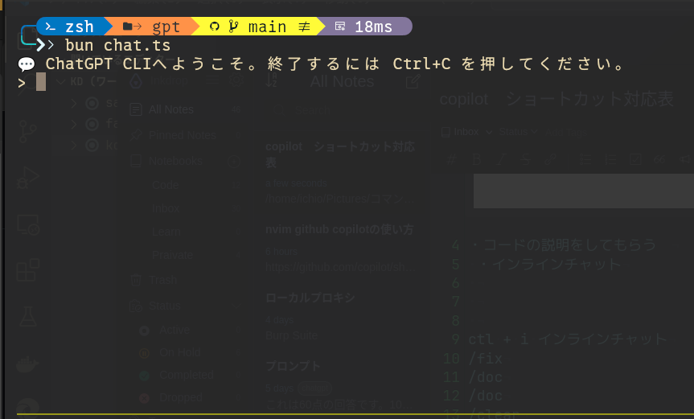

# gpt( chatgpt terminal cli util)

## bunで実装。
To install dependencies:
```bash
bun install
```
api token set
```bash
 touch .env
 echo "OPENAI_API_KEY=sk-XXXXXXXXXXXX" > .env
```

To run:

```bash
bun chat.ts
```

This project was created using `bun init` in bun v1.2.8. [Bun](https://bun.sh) is a fast all-in-one JavaScript runtime.
